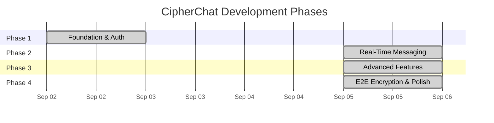

# 🔐 CipherChat — Phase Tracker

> **Project**: CipherChat — End-to-End Encrypted Real-Time Chat Application  
> **Stack**: MongoDB · Express.js · React · Node.js · Tailwind CSS · Socket.IO · Web Crypto API  
> **Total Phases**: 4  

---

## 📍 Current Status

| Field | Value |
|---|---|
| **Active Phase** | 🟢 **All 4 Phases Successfully Completed** |
| **Overall Progress** | ▓▓▓▓▓▓▓▓▓▓ 100% |
| **Last Updated** | 2026-09-05 |

---

## 🗺️ Phase Roadmap

| Phase | Name | Focus | Status |
|:---:|---|---|:---:|
| **1** | **Foundation & Authentication** | Project setup, DB, Auth, UI shell | ✅ **Completed** |
| **2** | **Real-Time Messaging** | Socket.IO, 1-on-1 chat, statuses, typing | ✅ **Completed** |
| **3** | **Advanced Features** | Groups, 50MB files, voice, reactions | ✅ **Completed** |
| **4** | **E2E Encryption & Polish** | AES-GCM-256 E2EE, safety numbers, web alerts, free stack | ✅ **Completed** |

---

---

## ✅ Phase 1 — Foundation & Authentication

> **Goal**: Set up the entire project skeleton, connect the database, implement full auth flow, and build the base UI layout.

### 🎯 Deliverables
- [x] Fully scaffolded monorepo (client + server + shared)
- [x] MongoDB connected with base models
- [x] Complete auth system (register → login → JWT → protected routes)
- [x] Base UI layout: sidebar + chat area shell with responsive design

### 📋 Tasks Completed
- [x] Monorepo npm workspaces configured
- [x] React + Vite + Tailwind CSS dark theme setup
- [x] Express + Mongoose free hosting setup (zero paid cloud dependencies)
- [x] Shared socket event, message type, and error constants
- [x] User, Chat, and Message database schemas
- [x] JWT access + refresh token rotation auth flow
- [x] Profile management, user search, and blocking APIs
- [x] Login & Register pages with demo account quick-fill (Alice & Bob)
- [x] Responsive split-view Home page with WhatsApp Web styling
- [x] Verified build with Vite (`npm run build --workspace=client`)

---

---

## ✅ Phase 2 — Real-Time Messaging

> **Goal**: Implement full real-time 1-on-1 chat with Socket.IO — including sending/receiving messages, delivery/read receipts, typing indicators, and online status.

### 🎯 Deliverables
- [x] Working 1-on-1 real-time chat between two users
- [x] Message status indicators (sent ✓ → delivered ✓✓ → read 🔵✓✓)
- [x] Live typing indicators
- [x] Online/offline status with last seen
- [x] Chat list sorted by latest message

### 📋 Task Checklist
- [x] Socket.IO event handler pipeline (`new message`, `typing`, `stop typing`, `user:status`)
- [x] Chat & Message REST endpoints (`/api/chats`, `/api/messages/:chatId`)
- [x] Live `MessageBubble` component with sent/received styling and ticks
- [x] `MessageInput` bar with send trigger & auto-scroll
- [x] Real-time `TypingIndicator`
- [x] Live user online/offline presence tracking via Socket.IO

---

---

## ✅ Phase 3 — Advanced Features

> **Goal**: Add group chats, file sharing (50MB), voice messages, message actions (reply, forward, delete, react), profile management, and search.

### 🎯 Deliverables
- [x] Full group chat system (create, manage members, admin roles)
- [x] 50MB file sharing (images, videos, documents, audio)
- [x] Voice message recording & playback (MediaRecorder API)
- [x] Message actions (reply quote, delete for me/everyone, emoji reactions)
- [x] Full text search within chats

### 📋 Task Checklist
- [x] Multer 50MB storage pipeline & static upload serving (`/api/messages/upload`)
- [x] Group chat APIs (`POST /api/chats/group`, rename, add member, remove member)
- [x] `CreateGroupModal` multi-select contact picker
- [x] `GroupInfoModal` participant manager & admin tools
- [x] `VoiceRecorder` real-time audio recorder with live waveform & timer
- [x] `FilePreviewModal` preview dialog with captions & size validator
- [x] `MessageActionsMenu` quick emoji reaction bar & delete modal
- [x] `MessageBubble` support for replies, media previews, audio player, & reactions
- [x] In-chat keyword search & match highlight in `ChatHeader` & `MessageBubble`

---

---

## ✅ Phase 4 — End-to-End Encryption & Polish

> **Goal**: Implement client-side 256-bit AES-GCM encryption, 60-digit safety verification numbers, desktop push notifications, zero-cost hosting clean up, and production audit.

### 🎯 Deliverables
- [x] Zero-Cost Free Stack: completely removed Redis requirement for 100% free Node.js + MongoDB + Socket.IO operation
- [x] Client-side AES-GCM 256-bit encryption with PBKDF2 (100,000 rounds) key derivation (`crypto.js`)
- [x] Automatic client encryption before transmission and transparent recipient decryption
- [x] WhatsApp-style 60-digit safety verification numbers matrix (`SecurityCodeModal.jsx`)
- [x] Interactive E2EE lock verification pill in chat header
- [x] Native Browser Desktop Notifications (`notifications.js`)
- [x] Production build validation with 0 errors
