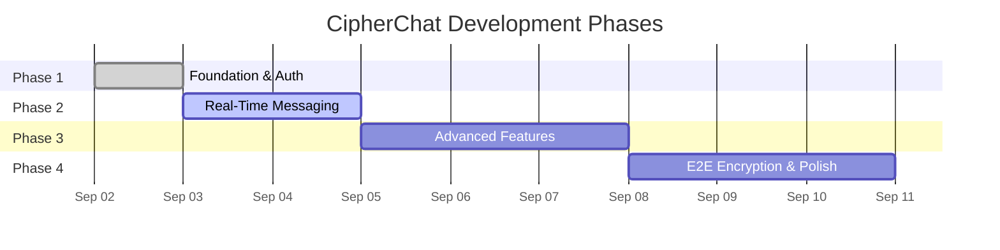

# 🔐 CipherChat — Phase Tracker

> **Project**: CipherChat — End-to-End Encrypted Real-Time Chat Application  
> **Stack**: MongoDB · Express.js · React · Node.js · Tailwind CSS · Socket.IO  
> **Total Phases**: 4  

---

## 📍 Current Status

| Field | Value |
|---|---|
| **Active Phase** | 🟡 **Phase 1 Completed / Ready for Phase 2** |
| **Overall Progress** | ▓▓▓░░░░░░░ 25% |
| **Last Updated** | 2026-09-02 |

---

## 🗺️ Phase Roadmap

| Phase | Name | Focus | Status |
|:---:|---|---|:---:|
| **1** | **Foundation & Authentication** | Project setup, DB, Auth, UI shell | ✅ **Completed** |
| **2** | **Real-Time Messaging** | Socket.IO, 1-on-1 chat, statuses, typing | 🟡 **Next Up** |
| **3** | **Advanced Features** | Groups, 50MB files, voice, reactions | ⬜ **Not Started** |
| **4** | **E2E Encryption & Polish** | Signal Protocol, notifications, deploy | ⬜ **Not Started** |

---

---

## ✅ Phase 1 — Foundation & Authentication

> **Goal**: Set up the entire project skeleton, connect the database, implement full auth flow, and build the base UI layout.

### 🎯 Deliverables
- [x] Fully scaffolded monorepo (client + server + shared)
- [x] MongoDB connected with base models
- [x] Complete auth system (register → login → JWT → protected routes)
- [x] Base UI layout: sidebar + chat area shell with responsive design

### 📋 Tasks Completed
- [x] Monorepo npm workspaces configured
- [x] React + Vite + Tailwind CSS dark theme setup
- [x] Express + Mongoose + Redis server setup
- [x] Shared socket event, message type, and error constants
- [x] User, Chat, and Message database schemas
- [x] JWT access + refresh token rotation auth flow
- [x] Profile management, user search, and blocking APIs
- [x] Login & Register pages with demo account quick-fill (Alice & Bob)
- [x] Responsive split-view Home page with WhatsApp Web styling
- [x] Verified build with Vite (`npm run build --workspace=client`)

---

---

## 🟡 Phase 2 — Real-Time Messaging (Next)

> **Goal**: Implement full real-time 1-on-1 chat with Socket.IO — including sending/receiving messages, delivery/read receipts, typing indicators, and online status.

### 🎯 Deliverables
- [ ] Working 1-on-1 real-time chat between two users
- [ ] Message status indicators (sent ✓ → delivered ✓✓ → read 🔵✓✓)
- [ ] Live typing indicators
- [ ] Online/offline status with last seen
- [ ] Chat list sorted by latest message

### 📋 Task Checklist
- [ ] Socket.IO event handler pipeline (`message:send`, `message:receive`, etc.)
- [ ] Chat & Message REST endpoints (`/api/chats`, `/api/messages/:chatId`)
- [ ] Live `MessageBubble` component with sent/received styling and ticks
- [ ] `MessageInput` bar with send trigger & auto-scroll
- [ ] Real-time `TypingIndicator`
- [ ] Live user online/offline presence tracking via Socket.IO

---

---

## ⬜ Phase 3 — Advanced Features

> **Goal**: Add group chats, file sharing (50MB), voice messages, message actions (reply, forward, delete, react), profile management, and search.

### 🎯 Deliverables
- [ ] Full group chat system (create, manage members, admin roles)
- [ ] 50MB file sharing (images, videos, documents, audio)
- [ ] Voice message recording & playback (MediaRecorder API)
- [ ] Message actions (reply quote, delete for me/everyone, emoji reactions)
- [ ] Full text search within chats

---

---

## ⬜ Phase 4 — End-to-End Encryption & Polish

> **Goal**: Implement Signal Protocol for E2EE, encrypt all messages and files client-side, add push notifications, finalize UI polish, and prepare for deployment.

### 🎯 Deliverables
- [ ] Signal Protocol key bundle generation & distribution (X3DH + Double Ratchet)
- [ ] Client-side message encryption & decryption
- [ ] Client-side file encryption (AES-256-GCM)
- [ ] Push notifications via Firebase Cloud Messaging
- [ ] Deployment & final security auditing
