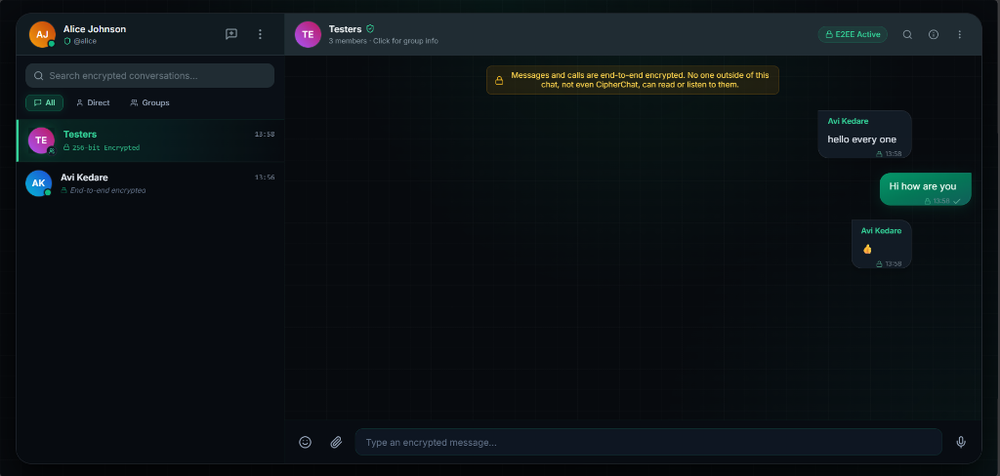
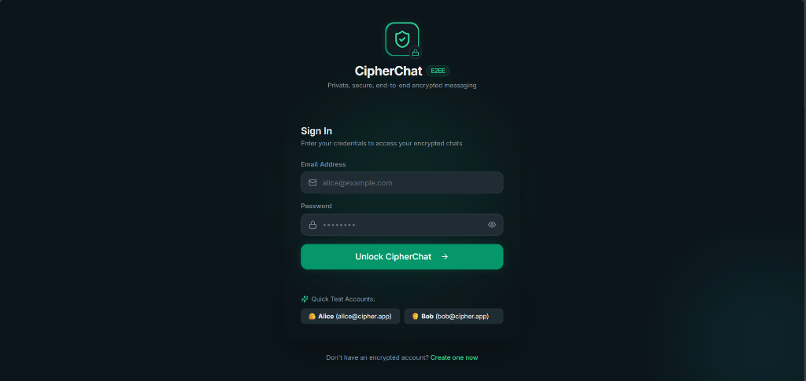
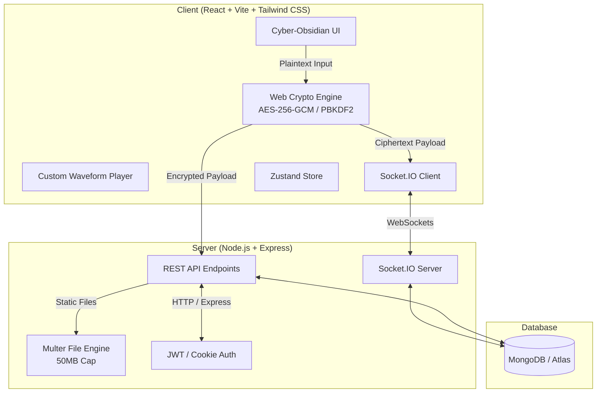

# 🔐 CipherChat

<div align="center">


**A Next-Gen, Quantum-Ready, End-to-End Encrypted Real-Time Messaging Platform.**  
*Crafted with an ultra-modern Cyber-Obsidian aesthetic, zero metadata leakage, and self-hosted simplicity.*

[Screenshots](#-preview--screenshots) • [Features](#-key-features) • [Architecture](#-architecture) • [Getting Started](#-getting-started) • [Cryptography](#-cryptographic-specifications) • [Tech Stack](#-tech-stack)

</div>

---

## 📸 Preview & Screenshots

<div align="center">

### 💬 Encrypted Chat Workspace
*Real-time group & 1-on-1 encrypted messaging with live typing, custom waveform audio notes, and floating cyber controls.*



<br/>

### 🛡️ Authentication & Quick Test Portal
*Sleek obsidian login card with instant one-click Alice & Bob testing credentials.*



</div>

---

## 🌟 Overview

**CipherChat** is a full-featured, secure real-time messaging application designed from the ground up for absolute privacy and modern aesthetics. Built without heavy, paid cloud dependencies, it delivers client-side **AES-256-GCM encryption**, instant **Socket.IO** synchronization, multi-format **50MB media sharing**, and **voice notes with dynamic waveforms** wrapped in a distinctive **Cyber-Obsidian** interface.

---

## 🚀 Key Features

### 🛡️ End-to-End Encryption (E2EE)
- **Zero-Knowledge Architecture**: Messages and payloads are encrypted directly in the client's browser before transmission using the **Web Crypto API**. The server only ever handles encrypted ciphertexts.
- **AES-256-GCM + PBKDF2**: Key derivation powered by 100,000 PBKDF2 hashing iterations and unique initialization vectors (IV) per message.
- **60-Digit Safety Number Verification**: Cryptographically verify peer safety numbers with formatted 12-block fingerprint matrix modals.

### ⚡ Real-Time Messaging & Presence
- **Instant Synchronization**: Bi-directional communication powered by **Socket.IO**.
- **Message Status Pipeline**: Real-time indicators for `Sent (✓)`, `Delivered (✓✓)`, and `Read (🔵✓✓)`.
- **Typing Indicators & Live Presence**: Smooth animated typing indicators and live online/last-seen timestamps.

### 🎙️ Audio & Voice Notes with Visual Waveform
- **Custom Waveform Player**: Integrated 28-bar reactive audio waveform with live duration playback counter.
- **Variable Playback Speeds**: Seamless **1x**, **1.5x**, and **2x** speed switching.
- **In-Browser Audio Recording**: Record and preview voice messages directly using the `MediaRecorder` API.

### 👥 Group Conversations & Media Sharing
- **End-to-End Encrypted Groups**: Create and manage encrypted rooms with custom avatars, descriptions, and participant management.
- **50MB Direct File Sharing**: Stream and exchange images, videos, audio, PDFs, and binary attachments with in-app preview dialogs.
- **Message Interactions**: Reply quoting, emoji reactions, and per-user message deletion.

### 🎨 Distinctive "Cyber-Obsidian" Design System
- Custom dark-mode glassmorphism interface featuring obsidian slate palettes, radiant emerald neon accents, dynamic particle grids, and smooth micro-animations.
- Instant category filters for **All**, **Direct**, and **Groups** chats.

---

## 🏗️ Architecture



---

## 🛠️ Tech Stack

### Frontend
- **Framework**: React 18 with Vite
- **Styling**: Vanilla Tailwind CSS + Custom Cyber-Obsidian Design Tokens
- **Icons**: Lucide React
- **State Management**: Zustand
- **Networking**: Axios & Socket.IO Client
- **Cryptography**: Native Browser Web Crypto API (SubtleCrypto)

### Backend
- **Runtime**: Node.js (ES Modules)
- **Framework**: Express.js
- **Real-Time Engine**: Socket.IO
- **Database**: MongoDB with Mongoose ORM
- **Authentication**: JSON Web Tokens (JWT) & HTTP-Only Secure Cookies
- **File Handling**: Multer (50MB storage handler)
- **Security**: Helmet, CORS, Rate-Limiting middleware

---

## 🔒 Cryptographic Specifications

CipherChat leverages the browser's native **SubtleCrypto** engine:

| Component | Standard |
|---|---|
| **Cipher Algorithm** | AES-GCM (Galois/Counter Mode) |
| **Key Length** | 256-bit |
| **Key Derivation** | PBKDF2 (SHA-256, 100,000 iterations) |
| **Initialization Vector (IV)** | 12-byte cryptographically secure random buffer |
| **Safety Code** | 60-digit deterministic SHA-512 fingerprint |

---

## 📂 Project Structure

```
CipherChat/
├── screenshots/                # Application preview images for GitHub
│   ├── chat-dashboard.png
│   └── login-screen.png
│
├── client/                     # React Vite Frontend
│   ├── src/
│   │   ├── components/
│   │   │   ├── auth/           # Login & Register forms with Quick Test pills
│   │   │   ├── chat/           # ChatWindow, MessageBubble, CustomAudioPlayer
│   │   │   ├── common/         # Avatars, Buttons, Search bars
│   │   │   ├── encryption/     # SecurityCodeModal, EncryptionNotice
│   │   │   └── sidebar/        # Sidebar, Header, Filter Tabs
│   │   ├── store/              # Zustand state stores (Auth, Chat, Socket, UI)
│   │   ├── utils/              # Crypto engines, formatters, notifications
│   │   └── index.css           # Cyber-Obsidian theme definitions
│   └── package.json
│
├── server/                     # Express.js & Socket.IO Backend
│   ├── src/
│   │   ├── controllers/        # Auth, Chat, Message, User logic
│   │   ├── middleware/         # Auth verification, rate limiting, error handlers
│   │   ├── models/             # Mongoose schemas (User, Chat, Message)
│   │   ├── routes/             # REST API routes
│   │   ├── sockets/            # Socket.IO connection handlers
│   │   └── utils/              # Auto-seeding utilities & token generators
│   ├── uploads/                # Static media store
│   └── package.json
│
├── package.json                # Root workspace configuration
└── README.md
```

---

## ⚡ Getting Started

### Prerequisites
- [Node.js](https://nodejs.org/) (v18.0.0 or higher)
- [MongoDB](https://www.mongodb.com/) (Local instance or free MongoDB Atlas URI)

---

### 1. Clone the Repository
```bash
git clone https://github.com/your-username/cipherchat.git
cd cipherchat
```

### 2. Install Dependencies
```bash
npm run install:all
```

---

### 3. Environment Configuration

#### Server Environment (`server/.env`)
Create a `.env` file in the `server` directory:
```env
PORT=5000
NODE_ENV=development
MONGO_URI=mongodb+srv://<username>:<password>@cluster.mongodb.net/cipherchat?retryWrites=true&w=majority
JWT_SECRET=your_super_secret_jwt_key_here
JWT_EXPIRES_IN=7d
CLIENT_URL=http://localhost:5173
```

#### Client Environment (`client/.env`)
Create a `.env` file in the `client` directory:
```env
VITE_API_URL=http://localhost:5000/api
VITE_SOCKET_URL=http://localhost:5000
```

---

### 4. Run in Development Mode

Run both server and client concurrently with a single command from the root directory:
```bash
npm run dev
```

- **Client App**: [http://localhost:5173](http://localhost:5173)
- **API Server**: [http://localhost:5000](http://localhost:5000)

---

## 🧪 Quick Test Demo Accounts

For rapid testing and pairing between two browser sessions, CipherChat automatically pre-seeds two demo accounts on startup:

| User | Email | Password |
|---|---|---|
| **Alice Johnson** | `alice@cipher.app` | `Alice@123456` |
| **Bob Smith** | `bob@cipher.app` | `Bob@123456` |

> 💡 *Clicking the **Quick Test** badges on the Sign In screen will auto-populate these credentials.*

---

## 📡 API Endpoints Overview

| Method | Endpoint | Description |
|---|---|---|
| `POST` | `/api/auth/register` | Register new user |
| `POST` | `/api/auth/login` | Authenticate user & issue cookie/token |
| `GET` | `/api/auth/me` | Fetch authenticated session |
| `GET` | `/api/users` | Search registered users |
| `GET` | `/api/chats` | Retrieve user conversation list |
| `POST` | `/api/chats` | Create or fetch 1-on-1 chat |
| `POST` | `/api/chats/group` | Create group conversation |
| `GET` | `/api/messages/:chatId` | Fetch encrypted chat history |
| `POST` | `/api/messages` | Send message payload |
| `POST` | `/api/messages/upload` | Upload media up to 50MB |

---

## 📜 License

Distributed under the **MIT License**. See `LICENSE` for more details.

---

<div align="center">

Made with 🛡️ for a Private, Open Web.

</div>
